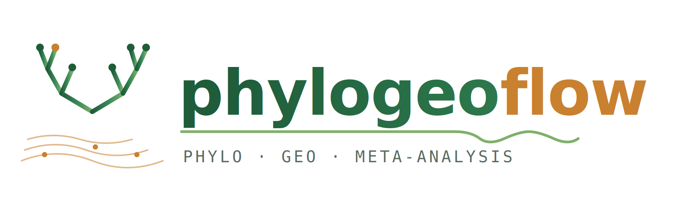
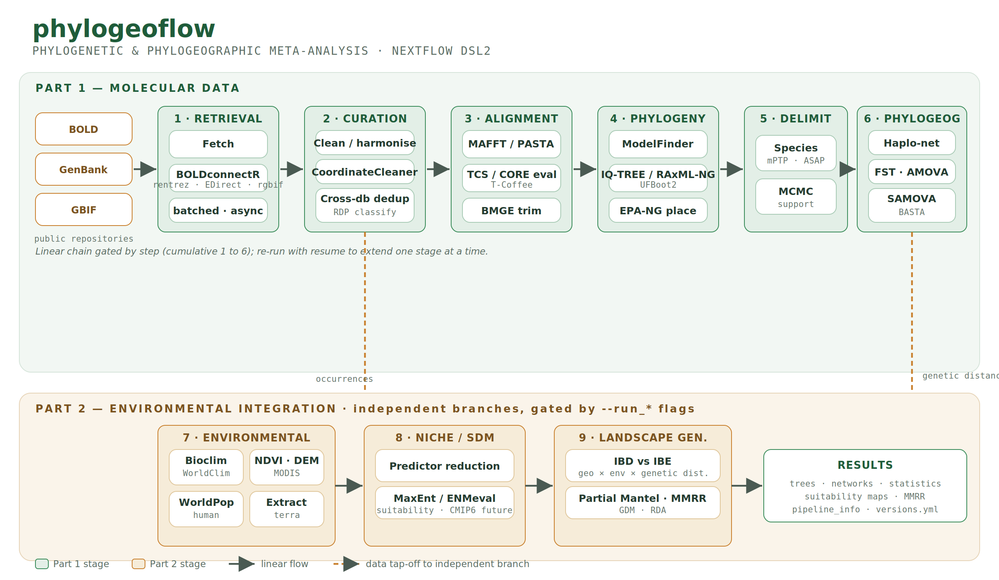

#  [UNDER ACTIVE DEVELOPMENT]

[](https://github.com/kibet-gilbert/phylogeoflow/actions/workflows/ci.yml)
[](https://github.com/kibet-gilbert/phylogeoflow/actions/workflows/linting.yml)
[](https://www.nf-test.com)

[](https://www.nextflow.io/)
[](https://docs.conda.io/en/latest/)
[](https://www.docker.com/)
[](https://sylabs.io/docs/)
[](https://opensource.org/licenses/MIT)

## Introduction

**phylogeoflow** is a reusable, end-to-end [Nextflow](https://www.nextflow.io) pipeline for the **phylogenetic, biodiversity, and phylogeographic meta-analysis of any target taxon**. It's goal is to integrate molecular data with environmental and anthropogenic covariates to explain the drivers of species distribution and genetic structure.

It is the 'pipeline-ified' successor to the [`co1_metaanalysis`](https://github.com/kibet-gilbert/co1_metaanalysis) MSc thesis project, which analysed COI barcodes of East African arthropods. phylogeoflow generalises that work from a collection of bespoke scripts into a portable, reproducible, nf-core-style workflow that can be re-targeted at any taxon - fruit-fly pests (*Ceratitis*, Tephritidae), disease vectors (biting Diptera), or any other group - and applied **iteratively at any rank** (species, genus, family, order, or higher).

The pipeline is written in Nextflow DSL2, uses one Conda environment / container per process for trivial installation and bit-for-bit reproducibility, and follows [nf-core](https://nf-co.re/) structure and conventions.

> [!NOTE]
> phylogeoflow adopts nf-core structure and tooling but is developed independently and is not (yet) an official nf-core pipeline.

> [!IMPORTANT]
> This README documents the **full intended scope** of phylogeoflow to guide its development. Modules move through three maturity states, marked throughout: 
> - ✅ **implemented**, 
> - 🚧 **scaffolded** (module/subworkflow stubs exist, logic being wired), 
> - 📋 **planned** (designed, not yet scaffolded).     
See the [Roadmap](#roadmap) for status at a glance.



## Scientific background & rationale

Many economically and medically important insect groups form **cryptic species complexes** that are hard to resolve on morphology alone. The pilot taxon, genus *Ceratitis* (Tephritidae), contains major frugivorous pests whose FAR/FARQ complex has repeatedly been re-delimited. Resolving such complexes requires **integrative taxonomy**: pooling all available molecular evidence, testing species boundaries statistically, and asking whether observed genetic structure is explained by geography, environment, or history.

**`phylogeoflow`** operationalises this in two parts:

- **Part 1 — Molecular meta-analysis:** harvest and harmonise all public sequence/occurrence data for a taxon; align, infer phylogeny, delimit species, and characterise population structure and phylogeographic differentiation.
- **Part 2 — Environmental integration:** retrieve climate, vegetation, topographic, hydrological, and human-population layers; run ecological niche / species distribution models (ENM/SDM); and test isolation-by-distance (IBD) vs isolation-by-environment (IBE) to explain the genetic structure found in Part 1.


## Pipeline summary

This pipeline has been designed with two two concepts in mind:   
 - **`--step N` (or a name):** to run stages 1..N of the linear Part-1 chain.   
 - **Independent branches:** Part 2 (environmental branch) to run alone because it only needs occurrence data, not the phylogenetics chain and can be launched separately.   

It is organised in two parts as:  
> a) ***retrieval*** → ***curation*** → ***aligment(MSA)*** → ***phylogenetics*** → ***species-delimitation*** → ***phylogeography***
> b) ***retrieval*** → ***EDM*** → ***SDM*** → ***landscape-genetics***.

### Part 1: Molecular data

**1. Data retrieval** (selectable via `--databases`)

- ✅ **BOLD** — via [`BOLDconnectR`](https://github.com/boldsystems-central/BOLDconnectR) (BCDM format); ID discovery then batched fetch to scale past per-call limits.
- ✅ **GenBank** — via **either** [Entrez Direct](https://www.ncbi.nlm.nih.gov/books/NBK179288/) **or** [`rentrez`](https://cran.r-project.org/package=rentrez); two interchangeable engines (`--genbank_engine edirect|rentrez|both`) that can run side by side for validation via `bin/compare_engines.R`.
- ✅ **GBIF** — via [`rgbif`](https://cran.r-project.org/package=rgbif) using the asynchronous `occ_download()` API, returning a **citable dataset DOI**.

**2. Taxonomic (re)Classification**   

- ✅ **RDP** — [RDPClassifier](https://github.com/rdpstaff/classifier) with the [COI eukaryote training set](https://github.com/terrimporter/CO1Classifier) (Porter & Hajibabaei); retain assignments meeting a length (≥500 bp) and bootstrap threshold, as in the original meta-analysis.
- ✅ **PROTAX-GPU/CPU** — [PROTAX-GPU](https://doi.org/10.1098/rstb.2023.0124) a GPU-accelerated JAX-based implementation of [PROTAX](https://doi.org/10.1093/bioinformatics/btw346) (Porter & Hajibabaei) - [PROTAX code](http://www.helsinki.fi/science/metapop/Software.htm).

**3. Curation & harmonisation**

- ✅ Per-database cleaners standardising to a shared schema: marker-name harmonisation, coordinate parsing, coordinate-quality filtering ([`CoordinateCleaner`](https://cran.r-project.org/package=CoordinateCleaner) for GBIF), deterministic deduplication.
- 🚧 **`harmonize`** — cross-database merge and deduplication (matching BOLD `insdc_acs` ↔ GenBank accessions, preferring the richer BCDM record) to avoid double-counting specimens present in multiple databases.

**4. Multiple sequence alignment & trimming**

- 📋 **Alignment** — [MAFFT](https://mafft.cbrc.jp/alignment/software/) (accurate) and [PASTA](https://github.com/smirarab/pasta) (scalable for very large sets) as selectable engines; [T-Coffee](https://tcoffee.org) regressive mode as an option. Rationale carried from the original work: MUSCLE global alignment struggles at scale; PASTA is fastest, MAFFT most reliably accurate, T-Coffee accurate but slow.
- 📋 **Alignment evaluation** — T-Coffee **CORE index** and **Transitive Consistency Score (TCS)** to score columns/sequences and drive filtering.
- 📋 **Trimming** — [BMGE](https://doi.org/10.1186/1471-2148-10-210) to remove ambiguous/saturated regions.

**5. Phylogenetic inference**

- 📋 **Model selection** — [ModelFinder](https://doi.org/10.1038/nmeth.4285) (IQ-TREE) or [ModelTest-NG](https://github.com/ddarriba/modeltest).
- 📋 **ML tree** — [IQ-TREE](http://www.iqtree.org/) with UFBoot2, and/or [RAxML-NG](https://github.com/amkozlov/raxml-ng) (higher-scoring on taxon-rich sets); [FastTree](http://www.microbesonline.org/fasttree/) for fast exploratory trees.
- 📋 **Placement / rooting** — [EPA-NG](https://github.com/Pbdas/epa-ng) to place query sequences into a reference tree and add outgroups.
- 📋 Tree outputs in Newick / NEXUS / phyloXML for [FigTree](http://tree.bio.ed.ac.uk/software/figtree/), [Archaeopteryx](https://sites.google.com/site/cmzmasek/), or [Dendroscope](http://dendroscope.org/).

**6. Species delimitation**

- 📋 [mPTP](https://github.com/Pas-Kapli/mptp) (multi-rate Poisson Tree Processes) with MCMC support values; optionally ASAP/bPTP as a second method for cross-validation.

**7. Population structure & phylogeography**

- 📋 **Haplotype networks** — [`pegas`](https://cran.r-project.org/package=pegas) (`haploNet`) / PopART-style networks; diversity indices (haplotype diversity *h*, nucleotide diversity *π*, segregating sites).
- 📋 **Differentiation** — [`diveRsity`](https://cran.r-project.org/package=diveRsity) / [`FinePop`](https://cran.r-project.org/package=FinePop) for Wright's *F*ST, Jost's *D*, Hedrick's *G'*ST (empirical-Bayes FinePop suits high-gene-flow species).
- 📋 **AMOVA** — variance partitioning among groups / localities / individuals (`pegas` / `ade4` / Arlequin).
- 📋 **Spatial clustering** — GENELAND / `tess3r` / SAMOVA to locate genetic boundaries and estimate the number of clusters *K*.
- 📋 **Neutrality & demography** — Tajima's *D*, Fu's *Fs*, mismatch distributions.
- 📋 **Historical biogeography** — [BASTA](https://doi.org/10.1371/journal.pgen.1005421) (structured coalescent in BEAST2) for migration/among-region history; [Gratton et al. geocoding](https://github.com/paolo-gratton/Gratton_et_al_JBiogeogr_2016) helper for coordinate handling.

### Part 2: Environmental Data integration, niche & landscape genetics

**8. Environmental data retrieval** 🚧/📋

- Bioclimatic variables ([WorldClim](https://www.worldclim.org/) 2.1 / [CHELSA](https://chelsa-climate.org/)) and future CMIP6 projections via [`geodata`](https://cran.r-project.org/package=geodata).
- Vegetation (MODIS NDVI/EVI, e.g. MOD13Q1) via [`MODISTools`](https://cran.r-project.org/package=MODISTools) or NASA [`earthaccess`](https://github.com/nsidc/earthaccess) / [`earthdatalogin`](https://boettiger-lab.github.io/earthdatalogin/).
- Elevation/terrain (Copernicus GLO-30 / SRTM), land cover (ESA WorldCover), water balance (TerraClimate: VPD, climatic water deficit) via `geodata` / [`climateR`](https://github.com/mikejohnson51/climateR).
- Surface water (JRC Global Surface Water); soil moisture (SMAP / ERA5-Land).
- Human population ([WorldPop](https://www.worldpop.org/)) to test anthropogenic (fruit-trade) dispersal hypotheses.

**9. Ecological niche / species distribution modelling (ENM/SDM)** 📋

- Predictor reduction (VIF / PCA) to handle collinearity of the 19 bioclim layers.
- Modelling with [`predicts`](https://cran.r-project.org/package=predicts) / MaxEnt and [`ENMeval`](https://cran.r-project.org/package=ENMeval); current + future suitability maps and variable importance — connecting to the pest-invasion-risk framing of the original work.

**10. Landscape genetics — IBD vs IBE** 📋

- Pairwise genetic distance (from Part 1) × geographic distance × environmental distance.
- **Partial Mantel** ([`vegan`](https://cran.r-project.org/package=vegan)), **MMRR** (Wang 2013), **GDM** ([`gdm`](https://cran.r-project.org/package=gdm)), and **RDA** for genotype–environment association — always partialling out geography before claiming an environmental effect.

**Cross-cutting utilities:** ✅ software-version reporting (`versions.yml`); 📋 aggregate MultiQC-style report; 📋 [PGDSpider](http://www.cmpg.unibe.ch/software/PGDSpider/) for format conversion between population-genetic tools.

## Roadmap

| Phase | Component | Status |
|---|---|---|
| 1 | BOLD / GenBank / GBIF retrieval + cleaning | ✅ implemented |
| 1 | RDP / PROTAX-GPU-CPU  Taxonomic Classification | ✅ implemented |
| 1 | `--help`, schema, profiles, stub tests | ✅ implemented |
| 1 | Cross-database `harmonize` | 🚧 scaffolded |
| 1 | RDPClassifier taxonomy | 📋 planned |
| 1 | MSA (MAFFT / PASTA / T-Coffee) + TCS/CORE eval + BMGE | 📋 planned |
| 1 | Phylogenetics (IQ-TREE / RAxML-NG, ModelFinder, EPA-NG) | 📋 planned |
| 1 | Species delimitation (mPTP) | 📋 planned |
| 1 | Population structure & phylogeography | 📋 planned |
| 2 | Environmental retrieval (geodata / MODIS / WorldPop) | 🚧 scaffolded |
| 2 | ENM / SDM | 📋 planned |
| 2 | Landscape genetics (Mantel / MMRR / GDM / RDA) | 📋 planned |

## Usage

> [!NOTE]
> New to Nextflow and nf-core? See [installation](https://nf-co.re/docs/usage/installation). Test your setup with `-profile test` before running on real data.

### 1. Credentials (Nextflow secrets)

A BOLD API key is issued only to accounts that have uploaded ≥10,000 records; GBIF needs a free account; an NCBI key is optional (raises rate limits).

```bash
nextflow secrets set BOLD_API_KEY  "<your-bold-key>"
nextflow secrets set GBIF_USER     "<your-gbif-user>"
nextflow secrets set GBIF_PWD      "<your-gbif-password>"
nextflow secrets set GBIF_EMAIL    "<your-gbif-email>"
# optional NASA Earthdata (Part 2): configure ~/.netrc for earthaccess / earthdatalogin
```

### 2. Offline dry run (recommended first)

Exercise the whole DAG with process stubs — no network/API access:

```bash
nextflow run . -profile test_stub,docker -stub
```

### 3. Minimal real run

#### 1. Run Part 1 (stages 1-6):   
Can be executed as one cumulative step or in individual stages using `--step` parameter:   
**`--step 6`** (the default) runs the whole Part-1 chain.   
```bash
nextflow run kibet-gilbert/phylogeoflow \
   -profile docker \
   --target_taxon Ceratitis \
   --step 6 \
   --taxon_rank genus \
   --markers COI-5P \
   --geography Kenya,Uganda,Tanzania \
   --country_codes KE,UG,TZ \
   --outdir results
```
>Each stage is wrapped in **`if ( runStage(N, target) )`**, and the **`resolveStep()`** helper, and   
>Accepts either a number or a stage name (**`--step curation`** is the same as **`--step 2`**).    
>With this the pipeline can be run sequentially as follows:   

Retrieve, then inspect results/retrieval/ to confirm downloads:    
**`--step 1`** runs only retrieval.
 ```bash
nextflow run kibet-gilbert/phylogeoflow \
   --target_taxon Ceratitis \
   --step 1 \
   -profile docker \
   --outdir results
```
Looks good? Continue to step 2 — retrieval is cached, only curation runs
**`--step 2`** runs ***retrieval*** + ***curation***.   
```bash
nextflow run kibet-gilbert/phylogeoflow \
   --target_taxon Ceratitis \
   --step 2 \
   -resume \ # makes it resume from step 1
   -profile docker \
   --outdir results
```
All checks out? Continue to step 3, and so on
**`--step 3`** runs ***retrieval*** + ***curation*** + ***alignment***.   
```bash
nextflow run kibet-gilbert/phylogeoflow \
   --target_taxon Ceratitis \
   --step 3 \
   -resume \
   -profile docker \
   --outdir results
 ```

#### 2. Run part-2 (stages 7,8,9):   
Environmental modelling segment can run independently by their own using `--run_*` parameter toggles.   
This runs retrieval + environmental, skipping stages 2-6 entirely because it needs only occurrence data.   
```bash
nextflow run kibet-gilbert/phylogeoflow \
   -profile docker \
   --target_taxon Ceratitis \
   --step 1 \
   --run_environmental \
   --outdir results
```
The workflow encodes the real dependencies with warnings.    
This lets you run branches in any valid combination without forcing the full chain:   
>SDM (8) warns if you enable it without --run_environmental; 
>landscape genetics (9) warns if --step is below 6 (it needs phylogeography) or environmental isn't set. 

### 4. Reproducible run via a taxon params file (preferred)

```bash
nextflow run kibet-gilbert/phylogeoflow \
   -profile docker \
   -params-file conf/taxa/ceratitis.yml \
   --outdir results
```

### 5. Iterating over a high-rank taxon

Set `--taxon_rank order` (or higher) to fan the run out over child taxa (e.g. Diptera → families), each processed independently and merged — the mechanism behind re-use across pests, vectors, or any group.

### Help

```bash
nextflow run kibet-gilbert/phylogeoflow --help
```

> [!WARNING]
> Provide parameters via the CLI or `-params-file`. Custom `-c` config files can set any configuration _**except parameters**_; see the [nf-core docs](https://nf-co.re/docs/usage/getting_started/configuration#custom-configuration-files).

## Pipeline output

Results are written under `--outdir`, organised by stage: per-database retrieval (`bold/`, `genbank/`, `gbif/`) with cleaned CSVs, FASTA files (BOLD/GenBank), summaries, and the GBIF DOI; the harmonised pooled dataset; alignments and trimmed alignments; trees and delimitation results; haplotype networks and phylogeographic statistics; environmental rasters and SDM outputs; and `pipeline_info/` with the execution report, timeline, trace, and collated `versions.yml`.

## Repository layout

```
phylogeoflow/
├── main.nf                      # entrypoint (--help, validation, spec assembly)
├── nextflow.config              # params, profiles, resource labels, manifest
├── nextflow_schema.json         # parameter schema (drives --help & validation)
├── conf/
│   ├── base.config              # resource defaults
│   ├── test.config              # small live-API test
│   ├── test_stub.config         # offline stub run
│   └── taxa/                     # per-taxon param sets (ceratitis.yml, ...)
├── modules/local/<db>/{fetch,clean}/main.nf
├── subworkflows/local/<stage>/main.nf
├── workflows/phylogeoflow.nf    # main workflow wiring
├── bin/                          # R/bash scripts called by processes
├── docs/                         # per-stage README documentation
└── workplan/                     # design notes / roadmap
```

## Credits

phylogeoflow was written by **Gilbert Kibet-Rono**, building on the `co1_metaanalysis` MSc project (MSc Molecular Biology and Bioinformatics, Department of Biochemistry, [JKUAT](http://www.jkuat.ac.ke/)), conducted at the [International Centre of Insect Physiology and Ecology (_icipe_)](http://www.icipe.org/), with data from [BOLD](https://www.boldsystems.org/), GenBank, and [GBIF](https://www.gbif.org/).

We thank for their guidance and support: Dr Scott E. Miller (Smithsonian Institution), Dr Jandouwe Villinger (_icipe_), Dr Steven Ger Nyanjom (JKUAT), Dr Caleb Kipkurui Kibet, Dr Jean-Baka Domelevo Entfellner (ILRI), and Dr Daniel Masiga (_icipe_).

## Contributions and Support

Contributions are welcome via issues and pull requests on the [GitHub repository](https://github.com/kibet-gilbert/phylogeoflow).

## Citations

Cite phylogeoflow using the metadata in [`CITATION.cff`](CITATION.cff) (and its Zenodo DOI once minted). A full, per-tool reference list is in [`CITATIONS.md`](CITATIONS.md).

This pipeline reuses infrastructure from the [nf-core](https://nf-co.re) community under the MIT license:

> **The nf-core framework for community-curated bioinformatics pipelines.** Ewels PA, Peltzer A, Fillinger S, Patel H, Alneberg J, Wilm A, Garcia MU, Di Tommaso P, Nahnsen S. _Nat Biotechnol._ 2020;38(3):276-278. doi: [10.1038/s41587-020-0439-x](https://doi.org/10.1038/s41587-020-0439-x).

> **Nextflow enables reproducible computational workflows.** Di Tommaso P, et al. _Nat Biotechnol._ 2017;35(4):316-319. doi: [10.1038/nbt.3820](https://doi.org/10.1038/nbt.3820).

## License

phylogeoflow is released under the [MIT License](LICENSE).
